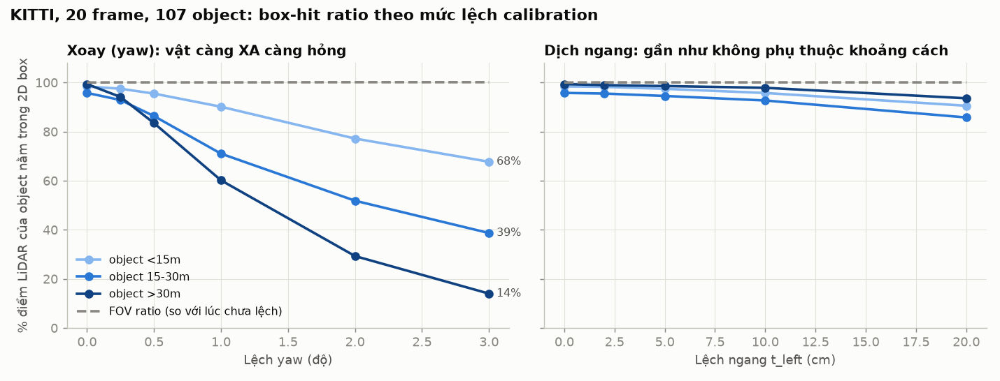
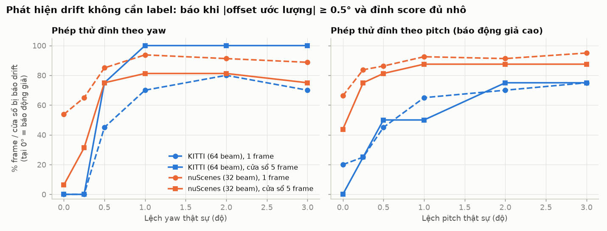
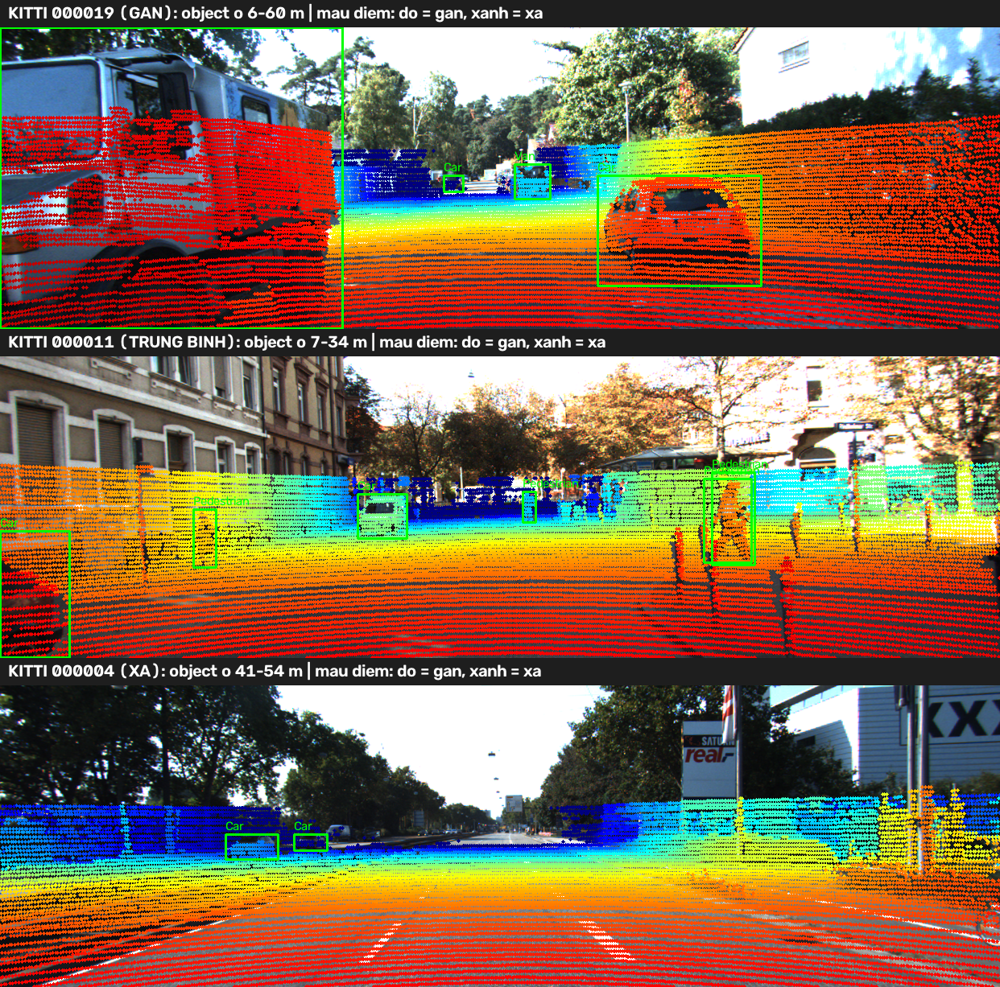
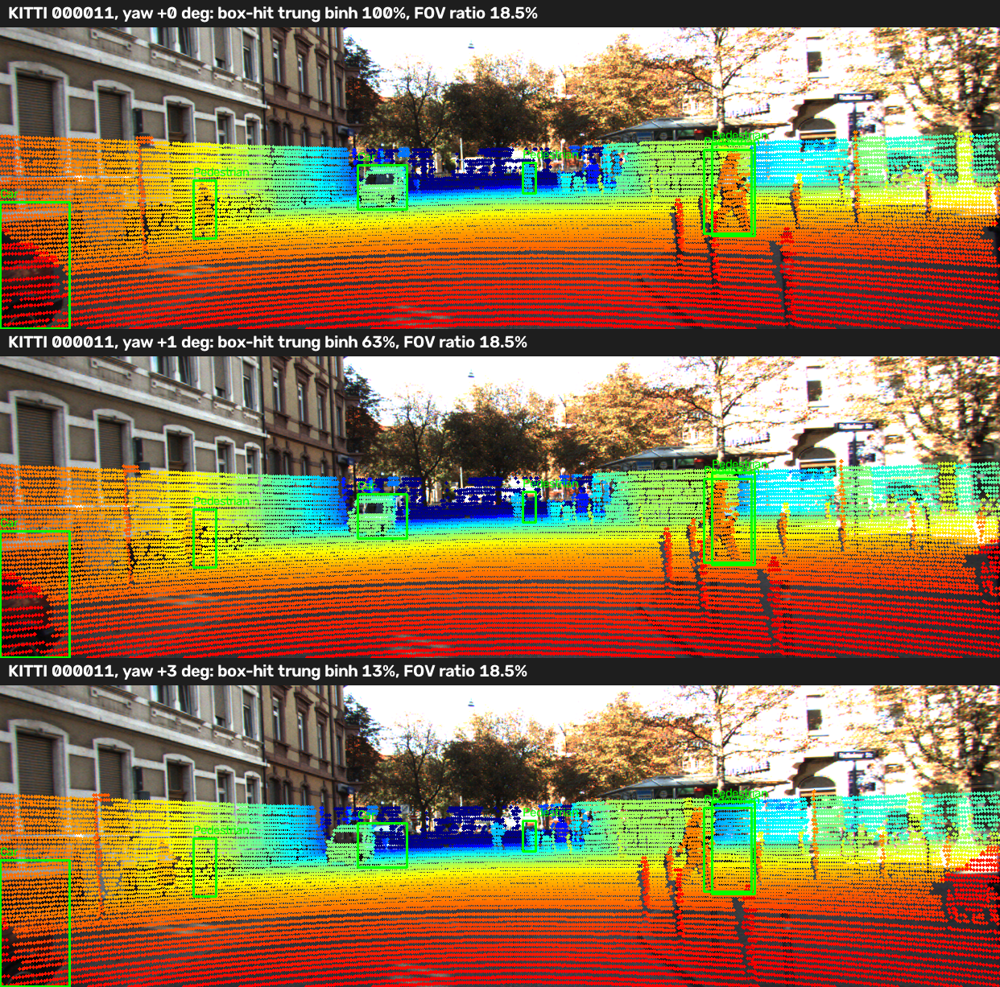
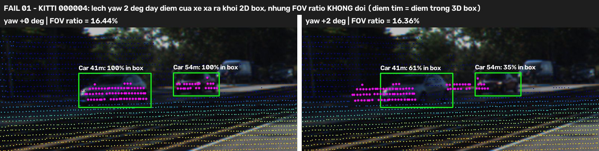
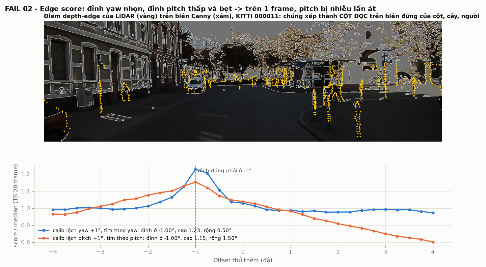
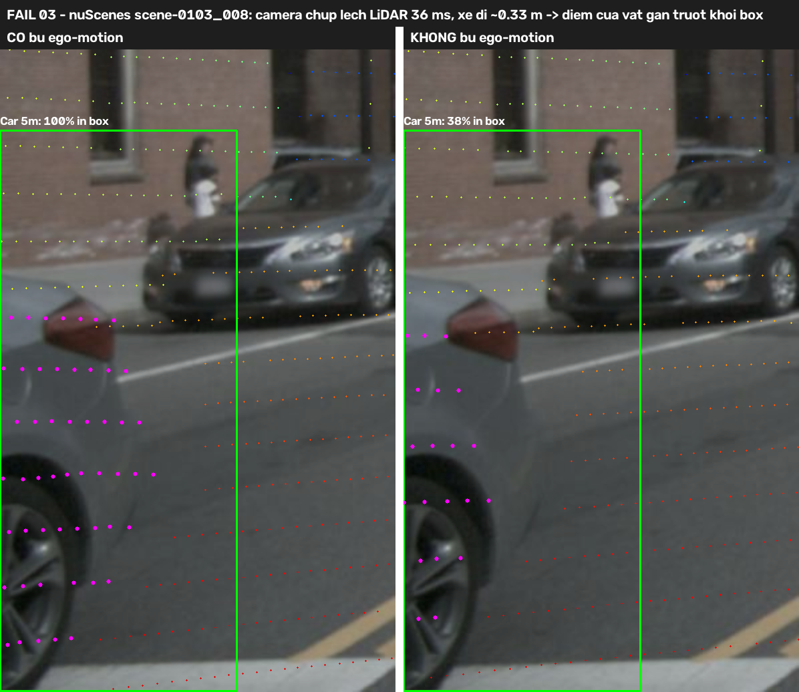

# Báo cáo Day 6: Calibration drift LiDAR-camera — lệch bao nhiêu thì hỏng, và tự phát hiện được không?

- **Họ tên:** Phạm Minh Hiếu
- **MSSV:** 2A202602919
- **Lớp:** VinUni AI20K — Track 4
- **Link repo:** https://github.com/BenKei-19/PhamMinhHieu-2A202602919-Track4-Day21
- **Topic:** A — LiDAR-camera projection QA
- **Dataset:** data/kitti_mini (thí nghiệm chính), data/nuscenes_mini_subset (so sánh, bonus B5), data/synthetic (debug + bonus B6)
- **Các frame đã dùng:** KITTI: toàn bộ 20 frame (000001 … 000061, 107 object có ≥ 10 điểm). nuScenes: toàn bộ 80 keyframe scene-0103_000 … 039 (ngày) và scene-1094_000 … 039 (đêm), 283 object. Synthetic: 000000 … 000004.

## 1. Claim

**Trên KITTI, lệch yaw chỉ 1° làm tỉ lệ điểm LiDAR của object rơi đúng vào 2D box giảm từ 97.7% xuống 73.3%. Object xa > 30 m chỉ còn 60%, người đi bộ/cyclist chỉ còn 39%. Trong khi đó, % điểm nằm trong FOV gần như không đổi (15.75% → 15.76%).** Vì vậy không thể dùng FOV ratio để phát hiện drift. Thay vào đó, một edge alignment score không cần label, cộng dồn trên cửa sổ 5 frame, phát hiện được lệch yaw ≥ 1° ở 100% cửa sổ trên KITTI (báo động giả 0%) và 81% trên nuScenes (báo động giả 6%). Score này yếu với pitch và không thấy được lệch dịch theo trục trước/lên.

## 2. Evidence

**Cách đo** (code: [src/calib_qa.py](../src/calib_qa.py), [src/calib_sweep.py](../src/calib_sweep.py)). Mỗi lần chạy chỉ làm lệch **một** trục của extrinsic, theo trục vật lý của xe, gồm yaw/pitch/roll 0.25–3° và dịch 2–20 cm. Frame, label và ngưỡng giữ nguyên. Thí nghiệm không có phép ngẫu nhiên nào: chạy lại 2 lần ra CSV giống hệt nhau (đã so md5). Ba metric:
1. **FOV ratio**: % điểm hữu hạn chiếu được vào ảnh.
2. **Box-hit ratio**: lấy điểm nằm trong 3D box của label (xác định bằng calib gốc), chiếu bằng calib lệch, rồi đo % điểm còn rơi vào 2D box. Điểm bị đẩy ra ngoài ảnh tính là trượt.
3. **Edge score** (không cần label): đo xem điểm LiDAR ở biên độ sâu có rơi gần biên Canny của ảnh không. **Phép thử đỉnh**: thử xoay thêm −4…+4° (bước 0.25°) và lấy góc cho score cao nhất. Calib đúng thì đỉnh nằm ở 0. Báo drift khi |đỉnh| ≥ 0.5° **và** đỉnh đủ nhô (max/median ≥ 1.15).

**Bảng 1 — KITTI, 20 frame, 107 object** ([results/calib_sweep_kitti.csv](../results/calib_sweep_kitti.csv), chi tiết từng object ở `_objects.csv`)

| Lệch | FOV ratio | Box-hit (tất cả) | < 15 m | 15–30 m | > 30 m | Người/cyclist | Dời pixel (trung vị) | Edge score / gốc |
|---|---|---|---|---|---|---|---|---|
| 0 (gốc) | 15.75% | 97.7% | 98.4% | 95.8% | 99.4% | 94.3% | 0 px | 1.00 |
| yaw 0.5° | 15.76% | 88.2% | 95.5% | 86.3% | 83.5% | 71.8% | 6.7 px | 0.90 |
| **yaw 1°** | **15.76%** | **73.3%** | 90.1% | 71.0% | **60.2%** | **38.9%** | 13.3 px | 0.84 |
| yaw 2° | 15.77% | 52.2% | 77.2% | 51.8% | 29.3% | 14.4% | 26.7 px | 0.81 |
| yaw 3° | 15.77% | 39.5% | 67.7% | 38.7% | 14.0% | 8.3% | 40.0 px | 0.80 |
| pitch 1° | 15.02% | 79.1% | 94.2% | 87.9% | 54.3% | 83.1% | 12.8 px | 0.90 |
| roll 1° | 15.76% | 96.2% | 96.3% | 93.7% | 99.2% | 93.2% | 2.7 px | 0.96 |
| t_left 10 cm | 15.76% | 95.2% | 95.7% | 92.7% | 97.9% | 88.2% | 3.4 px | 0.95 |
| t_left 20 cm | 15.76% | 89.7% | 90.5% | 85.8% | 93.6% | 74.3% | 6.9 px | 0.87 |
| t_fwd 20 cm | 16.41% | 97.2% | 97.5% | 95.4% | 98.9% | 93.0% | 1.4 px | 0.97 |

Đọc bảng: **xoay làm hỏng vật xa, dịch thì không phụ thuộc khoảng cách.** Khi xoay Δθ, mọi điểm dời một lượng gần như không đổi f·Δθ (với f = 721 px thì ≈ 12.6 px/°, đo được 13.3 px). Trong khi đó bề rộng box tính bằng pixel tỉ lệ 1/Z, nên vật xa và vật hẹp mất điểm nhiều nhất. Khi dịch Δt, cả độ dời lẫn bề rộng box đều tỉ lệ 1/Z, nên tỉ lệ hỏng chỉ phụ thuộc Δt/bề rộng vật: t_left 20 cm ra 90.5/85.8/93.6% ở 3 nhóm khoảng cách, nhưng người đi bộ (rộng ~0.6 m) chỉ còn 74%. Roll gần như vô hại vì tâm xoay nằm gần giữa ảnh.



**Bảng 2 — Phát hiện drift không cần label** (tỉ lệ frame/cửa sổ bị báo drift; dòng 0° = báo động giả) ([results/calib_sweep_*_windows.csv](../results/calib_sweep_kitti_windows.csv))

| Lệch yaw thật | KITTI 1 frame | KITTI cửa sổ 5 frame | nuScenes 1 frame | nuScenes cửa sổ 5 frame |
|---|---|---|---|---|
| 0° (báo động giả) | 0% | 0% (0/4) | **54%** | 6% (1/16) |
| 0.5° | 45% | 75% | 85% | 75% |
| 1° | 70% | **100%** | 94% | **81%** |
| 2° | 80% | 100% | 91% | 81% |

Ở mức từng frame, KITTI không báo động giả: đỉnh tìm được nằm trong ±0.25° quanh giá trị đúng ở 18/20 frame khi không lệch và 19/20 frame khi lệch 1°. Tuy vậy 30–35% frame bị "không kết luận" vì đường cong score quá phẳng. Ở nuScenes, phép thử từng frame vô dụng (báo động giả 54%), nên bắt buộc phải cộng dồn theo thời gian.



**Bonus B5 — KITTI vs nuScenes** ([sweep_04](../results/figures/sweep_04_kitti_vs_nuscenes_yaw.png), [sweep_02](../results/figures/sweep_02_edge_score_vs_drift.png)). Cùng lệch yaw 1°, nuScenes dời 25.4 px (gấp đôi KITTI, vì f = 1266 so với 721 px) nhưng box-hit chỉ giảm còn 92.8% (KITTI còn 73.3%). Có ba lý do:
- **Box nuScenes rộng gấp đôi theo góc** (trung vị 10.0° so với 5.2°). Box nuScenes là hình chữ nhật bao 8 góc của 3D box chiếu lên ảnh, nên rộng hơn box KITTI do người gán nhãn vẽ sát vật. Ngoài ra nuScenes có ít người đi bộ hơn (11% so với 22% object). Vì f triệt tiêu ở cả tử lẫn mẫu, cái quyết định là **tỉ số giữa góc lệch và bề rộng góc của box**, không phải số pixel.
- **LiDAR 32 beam thưa hơn.** Trung vị chỉ 28 điểm/object (KITTI 134), nên lọc ≥ 10 điểm chỉ giữ lại vật to và gần. Số điểm depth-edge mỗi frame cũng ít hơn (trung vị 1105 so với 3395), làm edge score trên từng frame nhiễu, dẫn tới 54% báo động giả.
- **Ban đêm** (scene-1094): đỉnh score thấp hơn (trung vị 1.24 so với 1.37 ban ngày). Cửa sổ báo động giả duy nhất (scene-1094_035…039, cho −3.5°) cũng là cảnh đêm. Ở đây biên Canny chủ yếu đến từ đèn đường, vệt lóa ống kính hình lưỡi liềm và nhiễu ảnh tối, không phải biên vật thể ([demo_03](../results/figures/demo_03_nuscenes_day_night.png)).

**Bonus B3 — Latency** ([results/latency.csv](../results/latency.csv), i7-11800H, chỉ dùng CPU, bỏ lần chạy đầu, đo 30 lần): chiếu toàn bộ point cloud mất p50 9.9 / p95 10.8 ms (KITTI, 108k điểm) và 2.8 / 3.2 ms (nuScenes, 35k điểm). Tìm depth-edge + Canny mất 22 / 24 ms. Phép thử đỉnh 33 góc mất 10.4 / 11.1 ms (KITTI). Tổng cộng < 50 ms/frame.

**Bonus B6 — Lỗi cài sẵn trong data/synthetic** (tự phát hiện bằng [src/synthetic_audit.py](../src/synthetic_audit.py), [results/synthetic_audit.csv](../results/synthetic_audit.csv)). Calib của 5 frame giống hệt nhau và label khớp point cloud (box-hit ≥ 99.5%), nên không có lỗi geometry.

| Lỗi | Frame bị lỗi | Cách phát hiện |
|---|---|---|
| Điểm NaN ở x, y, z (22–23 điểm/frame, 0.10%) | cả 5 frame 000000–000004 | đếm điểm không hữu hạn > 0. `cam_to_image` lọc NaN nên phép chiếu không bị ảnh hưởng |
| Mất một sector azimuth [−40°, −5°] (phía trước bên phải), ~1650 điểm, frame chỉ còn 92.8% số điểm | 000003 | so histogram azimuth 5° với trung vị cùng bin của các frame khác (< 50%) và tổng số điểm < 97% trung vị |
| Timestamp nhảy cóc 0.2 → 0.4 s (rơi 1 frame) | giữa 000002 và 000003 | dt > 1.5 lần trung vị dt (0.1 s) |

**Ảnh demo:** overlay ở 3 khoảng cách (gần 000019, trung bình 000011, xa 000004) và cùng một frame ở yaw 0/1/3°.




## 3. Failure case

**FAIL 01: lệch yaw 2°, xe xa mất điểm nhưng FOV ratio không đổi** (lớp **Geometry** cộng lớp **Metric**).



Ở KITTI 000004, với cùng lệch 2°, box-hit của xe 41 m giảm 100% → 61% và của xe 54 m giảm 100% → 35%, trong khi FOV ratio chỉ đổi 16.44% → 16.36%. **Khi nào sai:** khi extrinsic bị xoay, ví dụ giá đỡ sensor lệch sau va chạm hoặc do rung. Vật xa và vật hẹp hỏng trước (xem Bảng 1). **Vì sao:** xoay dời mọi pixel một lượng ≈ f·Δθ không đổi, còn box của vật xa thì nhỏ. Khi fusion, điểm LiDAR của xe sẽ bị gán sang nền, nên độ sâu và TTC của object bị sai. FOV ratio không thấy được vì điểm vẫn nằm trong ảnh, chỉ là sai chỗ. **Cách phát hiện khi chạy thật:** dùng box-hit giữa box của detector 2D và cụm điểm LiDAR, hoặc edge score với phép thử đỉnh trên cửa sổ nhiều frame (Bảng 2). Không dùng FOV ratio để giám sát calibration.

**FAIL 02: alignment score yếu với pitch, không thấy được dịch t_fwd/t_up** (lớp **Metric**, do cách thiết kế score). Đây là case mà score không phát hiện được (yêu cầu Advanced).



Pitch 1° làm box-hit KITTI giảm còn 79.1% (vật > 30 m còn 54.3%). Nhưng trung bình 20 frame, đỉnh score theo pitch thấp và bẹt (cao 1.15, rộng 1.5°), trong khi đỉnh theo yaw nhọn (cao 1.23, rộng 0.5°). Trên từng frame, nhiễu lấn át đỉnh pitch: phép thử pitch báo động giả 20% (KITTI) và 66% (nuScenes), và chỉ bắt được pitch 1° ở 50% cửa sổ KITTI. Với t_fwd/t_up 20 cm, score KITTI vẫn ≥ 0.96 và tỉ lệ phát hiện là 0%. **Nguyên nhân gốc:** depth-edge được tìm từ hai điểm kề nhau **trên cùng một beam** (theo phương ngang), nên chúng nằm trên **biên đứng** của cột, cây, người. Trong ảnh, chúng xếp thành cột dọc. Khi lệch pitch, điểm trượt dọc theo chính biên đó nên score gần như không đổi. Dịch theo trục trước/lên làm vật xa gần như không dời (dời ∝ Δt/Z). **Cách khắc phục:** thêm depth-edge theo phương dọc (so sánh giữa các beam), dùng biên ngang như mép đường hay chân xe, ước lượng pitch riêng từ mặt phẳng đường, và kiểm tra lệch dịch bằng vật gần.

**FAIL 03: không bù chuyển động giữa LiDAR và camera** (lớp **Time**, [results/time_sync_nusc.csv](../results/time_sync_nusc.csv)).



Ở nuScenes, camera chụp trước LiDAR trung vị 35.5 ms. Trong khoảng đó xe đi được 0.25 m (tối đa 0.45 m). Nếu bỏ bù ego-motion, box-hit trung bình 80 frame giảm 99.5% → 96.7%. Frame tệ nhất là scene-0103_008: xe đỗ cách 5 m giảm 100% → 38%. Vật **gần** và ở **bên hông** hỏng nặng nhất (thị sai), ngược với FAIL 01. **Cách phát hiện:** ghi log Δt = t_camera − t_lidar và tích tốc độ × Δt ở mỗi frame, rồi báo động khi vượt khoảng 0.1 m mà chưa bù.

## 4. Khuyến nghị nếu triển khai thật

**Use-case:** fusion camera-LiDAR cho ADAS, cụ thể là phanh khẩn cấp (AEB) có nhận diện người đi bộ. LiDAR cấp độ sâu cho box 2D của camera. Theo Bảng 1, chỉ cần lệch yaw 1° là người đi bộ chỉ còn 39% điểm đúng, nên độ sâu và TTC gán cho người sẽ sai. Vì vậy calibration phải được **giám sát liên tục**, không chỉ hiệu chỉnh một lần ở xưởng.
- **Đánh đổi:** edge score không cần label, nhưng trên CPU tốn khoảng 22 ms để tìm depth-edge + Canny và khoảng 10 ms cho phép thử đỉnh mỗi frame. Nên chạy nền ở 1–2 Hz và cộng dồn cửa sổ 5 frame, không chạy ở mọi frame 10 Hz. Cửa sổ dài hơn thì ít báo động giả hơn nhưng phát hiện chậm hơn. Ở nuScenes, 1 frame cho 54% báo động giả, còn 5 frame chỉ 6%. LiDAR 32 beam cần cửa sổ dài hơn LiDAR 64 beam.
- **Ngưỡng an toàn:** báo drift khi |yaw ước lượng| ≥ 0.5° trên 2 cửa sổ liên tiếp. Khi đó hệ thống hạ cấp fusion (chỉ dùng camera hoặc chỉ dùng LiDAR) và yêu cầu hiệu chỉnh lại. Pitch và lệch dịch cần kiểm tra riêng (FAIL 02).
- **Chỉ số cần ghi log mỗi cửa sổ:** yaw/pitch ước lượng và độ nhô đỉnh, số điểm depth-edge, mật độ biên Canny (giảm mạnh ban đêm), box-hit giữa box detector 2D và cụm LiDAR, Δt camera−LiDAR, tốc độ × Δt, % frame "không kết luận". FOV ratio chỉ dùng để bắt lỗi thô như mất sensor hay sai calib file, không dùng để đo drift.
- **Bước tiếp theo:** thêm depth-edge theo phương dọc để bắt pitch, rồi thử trên log dài có drift thật (ví dụ sau khi tháo lắp sensor).

## 5. Cách chạy lại

Chạy từ gốc repo, trên Python 3.10+ (đã thử với 3.13, chỉ dùng CPU). Các bước không có phép ngẫu nhiên nên CSV ra giống hệt nhau. Riêng latency phụ thuộc máy.

```bash
python -m venv .venv
.venv\Scripts\activate            # macOS/Linux: source .venv/bin/activate
pip install -r requirements.txt

# CP2: kiểm tra TODO + overlay gốc
python -m starter.projection --data-root data/synthetic --frame 000000
python -m starter.projection --data-root data/kitti_mini --frame 000011
python -m starter.projection --data-root data/nuscenes_mini_subset --frame scene-0103_010

# CP3: sweep calibration drift (~30 s và ~60 s), ra results/calib_sweep_*.csv
python -m src.calib_sweep --data-root data/kitti_mini --tag kitti
python -m src.calib_sweep --data-root data/nuscenes_mini_subset --tag nusc
python -m src.make_figures            # results/figures/sweep_0*.png

# CP4: demo + failure + Time + audit synthetic + latency
python -m src.make_demos              # results/figures/demo_0*.png, fail_0*.png
python -m src.time_sync_check         # results/time_sync_nusc.csv
python -m src.synthetic_audit         # results/synthetic_audit.csv
python -m src.latency_bench           # results/latency.csv

# Bonus B4: các script đều có --help và tham số, dùng lại được cho dataset KITTI/nuScenes khác, ví dụ:
python -m src.calib_sweep --help
python -m src.calib_sweep --data-root data/kitti_mini --tag kitti_yaw --axes yaw --rot-levels 0.5 1 2 --window 3
```

## 6. Khai báo sử dụng AI

| Công cụ | Dùng cho việc gì | Bạn đã kiểm chứng thế nào |
|---|---|---|
| Claude Code (Claude Opus 5.5, Anthropic) trong VS Code | Viết 2 hàm TODO trong `starter/projection.py`; viết toàn bộ code trong `src/` (metric box-hit, edge score Levinson & Thrun 2013, phép thử đỉnh, sweep, vẽ biểu đồ, audit synthetic, latency); chạy thí nghiệm; viết nháp REPORT | (1) Test tay theo CP2: điểm (10, 0, 0) cho z_cam = 9.727, pixel (613.96, 175.01), khớp giá trị ≈ (614, 175) trong CHECKPOINTS; điểm NaN và điểm sau camera bị loại. (2) Xem overlay của cả 3 dataset: điểm khớp xe, người, cột, không có điểm trên trời. (3) Ở calib gốc, box-hit ≈ 98–100% và đỉnh edge score nằm trong ±0.25° quanh 0° trên 18/20 frame KITTI. (4) Kiểm tra số liệu bằng công thức: độ dời 13.3 px/° (KITTI) và 25.4 px/° (nuScenes) gần với f·π/180 = 12.6 và 22.1 px/°. (5) Chạy lại toàn bộ thí nghiệm lần 2, so md5 thấy CSV giống hệt. (6) Một giả thuyết ban đầu ("edge score hoàn toàn mù với pitch") bị dữ liệu bác bỏ: trung bình 20 frame vẫn có đỉnh pitch đúng ở −1°. Kết luận đã được sửa thành "đỉnh pitch bẹt và thấp, nên trên từng frame bị nhiễu lấn át" |
